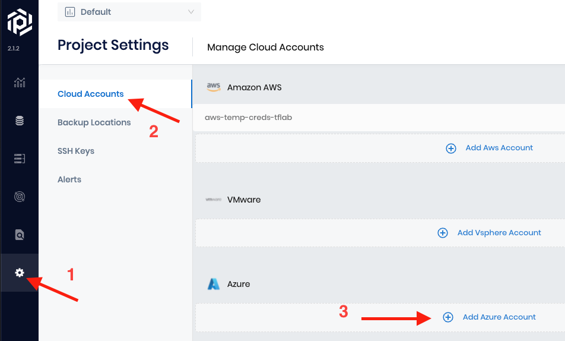
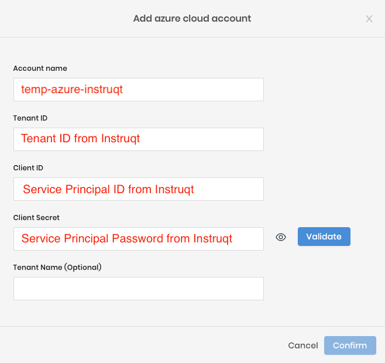

<h2>Prepping your environment</h2>

Before using Palette to deploy into the Azure subscription
we need to create an Azure Resource Group that will be used for creating K8s infrastructure

<h2>Using the Azure CLI</h2>


The Azure CLI is pre-installed for you and logged in with the temp credentials provided

In the terminal run this command

```bash
az group create --name MyResourceGroup --location eastus
```

You should see this type of output

```
{
  "id": "/subscriptions/5629542c-39a2-4bce-81bf-cbebf4f1c511/resourceGroups/MyResourceGroup",
  "location": "eastus",
  "managedBy": null,
  "name": "MyResourceGroup",
  "properties": {
    "provisioningState": "Succeeded"
  },
  "tags": null,
  "type": "Microsoft.Resources/resourceGroups"
}
```

*you can customize the --location to an Azure region of your choice

Good job creating a Resource Group, let's move on.


<h2>My Azure CLI is broken ☹️</h2>


If you were not able to create the resource group your Azure cli may not be logged in

Try running this command

```bash
az login --service-principal -u $ARM_CLIENT_ID -p=$ARM_CLIENT_SECRET --tenant $ARM_TENANT_ID
```

Then try again

```bash
az group create --name MyResourceGroup --location eastus
```

<h2>Configure a cloud account in Palette</h2>

Create a Spectro Cloud Palette trial or log into your existing trial account

Navigate to the Project Settings> Cloud Accounts > Add Azure Account



In the Instruqt tab **Azure Portal** copy your cloud credentials

and paste them into the Palette configuration wizard

Follow this image for the corresponding values



Click **Validate** then **Confirm**